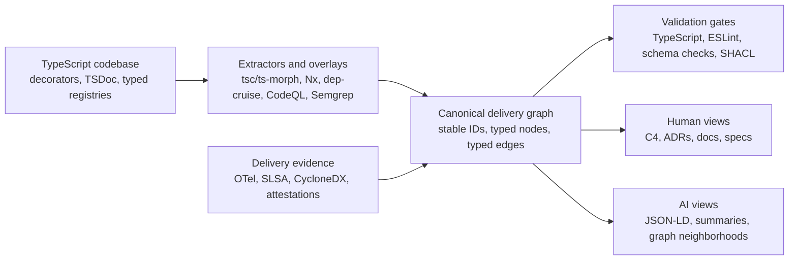

# Designing an Annotation-Driven Delivery Graph for Complex TypeScript Codebases

## Core conclusion

The strongest option for the kind of system you described is a **hybrid, annotation-driven delivery graph**: use TypeScript source as the authoring surface for explicit business and architectural meaning, add compiler- and build-time extraction to infer structural and semantic relationships, normalize all of it into one canonical graph, and generate every human-facing or AI-facing view from that graph. In practice, that means **not** relying on a plain language-server index, but instead combining TypeScript compiler data, project/dependency graphs, explicit annotations, semantic query engines, and standards-backed exports. The result can cover architecture, requirements, decisions, APIs, workflows, tests, builds, deployments, and evidence in one model. citeturn18view4turn17view1turn15view4turn20view0turn17view16turn17view15

A second key conclusion is that **annotations alone are not enough**, and **inference alone is not trustworthy enough**. Explicit markers are needed for intent-rich facts such as “this requirement is realized by these handlers,” “this decision constrains these components,” or “this scenario verifies this capability.” But inferred overlays are equally important for facts developers will not reliably maintain by hand, such as import dependencies, data flows, call paths, cyclic dependencies, or CI/CD provenance. The winning design is therefore a graph with **declared edges** and **derived edges**, both queryable, both validated, but clearly distinguished. citeturn18view7turn27view1turn15view4turn28view0turn19view2

The third conclusion is architectural: the **authoritative source of truth should live in the repository as typed code and generated artifacts**, while graph databases, documentation sites, and AI indexes should be treated as **derived projections**, not primary stores. That keeps change review in Git, enables compile/lint/test gates, and avoids divergence between “what the repository says” and “what the graph server says.” This is the same reason tools such as Structurizr, TypeDoc, OpenAPI, and AsyncAPI emphasize model/spec-as-code that then emits multiple downstream outputs. citeturn20view7turn25view0turn17view12turn17view11

## What the ecosystem already provides

TypeScript already gives you several strong annotation surfaces, but they have different strengths. **Standard decorators** in TypeScript 5 are reusable annotations over classes and members, and TypeScript also documents how to write them in a well-typed way. However, the modern decorators proposal is **not compatible with `--emitDecoratorMetadata`** and **does not allow parameter decorators**, which makes decorators useful as a concise local signal but a poor sole foundation for a long-lived repository-wide metadata system. Legacy decorator metadata still exists behind `emitDecoratorMetadata`, but it is explicitly experimental. citeturn18view5turn18view6turn22view0turn22view3

For repository-friendly, framework-agnostic marking, **TSDoc and doc-comment tags are a better backbone**. TSDoc distinguishes **block tags, modifier tags, and inline tags**; API Extractor extends TSDoc with configurable custom tags in `tsdoc.json`; TypeDoc can also define supported tags via `tsdoc.json`, render unknown custom tags without warnings, and use modifier tags such as release/stability markers. That makes comment tags a good place for durable, reviewable semantics such as `@capability`, `@requirement`, `@decision`, `@trace`, `@owner`, `@evidence`, or `@state`. citeturn37view0turn16view5turn20view8turn19view7turn17view8

For graph extraction, the TypeScript ecosystem already has the right primitives. The **TypeScript compiler API** models the whole application as a `Program` composed of `SourceFile`s; **ts-morph** wraps that API to make AST navigation and manipulation easier; **Nx** computes a workspace **Project Graph** and can export it to JSON; **Nx project-graph plugins** can add new nodes and dependencies; **dependency-cruiser** supports declarative rules over dependencies and checks rule sets against a JSON schema; **CodeQL** and **Semgrep** both support JavaScript/TypeScript data-flow analysis, with Semgrep documenting cross-file dataflow for TypeScript. A code-property-graph approach, as documented by Joern, adds another useful idea: layered graph overlays that merge syntax, control flow, and data flow into one queryable representation. citeturn18view4turn18view3turn35view0turn18view7turn27view1turn27view3turn15view4turn28view0turn24view0

For downstream projections, the ecosystem is also mature. **TypeDoc** can emit reflection JSON, and `typedoc-plugin-markdown` adds Markdown output for repos, wikis, and static sites. **C4** supplies hierarchical architecture abstractions; **Structurizr** turns a single model into multiple C4 diagrams; **ADRs** capture individual architectural decisions and rationale. For executable or implementation-adjacent specifications, **TypeSpec** emits OpenAPI, while **OpenAPI** and **AsyncAPI** provide machine-readable contracts for synchronous and asynchronous APIs. For requirements-management interoperability, **ReqIF** is the current standards-based format, and **SysML v2** plus the **Systems Modeling API and Services** specification show a more formal, API-addressable path for requirements, behavior, structure, verification, consistency, and traceability. citeturn25view0turn32view0turn20view6turn20view7turn16view15turn18view0turn18view2turn17view12turn17view11turn16view16turn16view1turn16view17

## Annotation and extraction patterns

A **decorator-first design** is attractive when you want low-friction, inline marking on classes, methods, and properties. It works especially well for local concerns such as domain role, lifecycle, capability ownership, or runtime registration. But because standard decorators do not give you legacy metadata emission and do not cover parameters, they should be treated as a **local convenience channel**, not as the canonical store for all architectural and delivery semantics. citeturn18view5turn22view0

A **comment-tag-first design** is better for repository-wide semantics because it is framework-neutral, easy to diff, and easy to parse in build tools. TSDoc’s tag model and API Extractor/TypeDoc configuration support mean you can define a stable vocabulary of tags and then use the same comments for linting, graph extraction, API docs, markdown docs, and search indexes. This is the most practical way to “mark” requirements, decisions, stability, ownership, trace links, and evidence references without overloading runtime semantics. citeturn37view0turn16view5turn20view8turn19view7turn17view8

A **typed registry or DSL-in-TypeScript design** is the best option when the delivery process itself must become part of the codebase with compilation guarantees. In that pattern, requirements, capabilities, scenarios, decisions, components, contracts, and trace links are declared as typed objects or function calls in dedicated modules. TypeScript’s `satisfies` operator preserves precise inferred types while checking conformance, and `as const` preserves literal IDs and discriminants. This is the closest TypeScript-native answer to “persistent delivery state as bespoke code.” It is also much safer than using type assertions as a primary mechanism, because TypeScript explicitly notes that type assertions are removed at compile time and provide no runtime checking. citeturn17view4turn33view0turn36view0

An **inference-first overlay design** is the right companion to any of the above. Nx can derive workspace/project relationships from source, dependency-cruiser can enforce and visualize import boundaries, CodeQL and Semgrep can recover semantic and data-flow relationships, and code-property-graph thinking shows how overlays let one graph represent multiple abstraction levels at once. This is the right place to infer “module A depends on module B,” “request input reaches store X,” “feature Y transitively touches service Z,” or “this decision affects these dependents.” It is also the right place for selective auto-suggestion of trace links. citeturn35view2turn27view1turn15view4turn28view0turn24view0

The best overall design is therefore a **hybrid**: explicit tags and typed registries for meaning, plus extracted overlays for structure and behavior. That directly addresses your requirement for both **manual marking** and **automatic recognition**. citeturn18view7turn24view0turn15view4turn28view0

## Graph and metamodel choices

The canonical graph should use a **small, stable core metamodel** and then layer specialized submodels on top. A practical core is: `Requirement`, `Capability`, `Decision`, `Component`, `Module`, `Contract`, `Workflow`, `Scenario`, `Test`, `Artifact`, `Build`, `Deployment`, `Evidence`, and `Observation`, connected by edges such as `decomposesTo`, `constrains`, `implements`, `dependsOn`, `verifies`, `documents`, `produces`, `deploys`, `observes`, and `supersedes`. The important design choice is not the exact names; it is that the same node/edge kinds exist at every maturity level, while completeness rules tighten as an item moves from idea to draft to specified to implemented to verified to released. That matches the “same shape, more detail over time” requirement and aligns well with SysML v2’s formal, traceable modeling stance. citeturn16view1turn16view17

For storage and interchange, there are two serious options. A **property-graph mirror** is excellent for fast graph traversals, dependency analysis, slice queries, and impact analysis; Neo4j’s model of nodes and relationships maps naturally to software artifacts and trace edges. A **semantic-web / linked-data export** is better for interoperability and standards-based constraints; JSON-LD gives a JSON-compatible path to Linked Data, SPARQL gives a standard graph query language, SHACL gives graph-shape validation, and PROV-O gives a portable vocabulary for provenance. For your goals, the best pattern is usually **author in TypeScript, export to JSON-LD, optionally mirror to a property graph for interactive analysis**. citeturn19view9turn20view0turn17view14turn17view15turn17view16

Traceability deserves special treatment. Requirement-to-code links are useful because they help engineers see which code realizes which requirement and reduce mental-model drift as systems evolve. But manually maintaining all such links is costly and error-prone; open research continues on automatic recovery techniques that use identifiers, comments, and relations to recover candidate requirement-to-code links. That makes automatic trace recovery valuable as a **bootstrap and suggestion engine**, but it should not be your authoritative truth. The authoritative truth should stay in explicit links created or accepted in the repository. citeturn38view1

If you want a stronger closed-world constraint system than TypeScript alone can comfortably express, **CUE** is worth considering as a companion rather than a replacement. CUE’s unification model treats conflicting declarations as errors and its constraints can validate concrete data from JSON, YAML, or other sources. That maps unusually well to “same shape, progressively more constrained detail,” especially for delivery metadata and policy-heavy graph fragments. citeturn16view18turn16view19

## Compile-time and CI enforcement

The enforcement model should be layered. At the first layer, keep graph-authoring code in TypeScript and use **literal IDs with `as const`** and **shape checking with `satisfies`** so that missing fields, wrong enums, malformed discriminants, or illegal combinations fail early. Use **project references** to split very large repositories into smaller units and improve build times and logical separation; TypeScript also documents incremental build state via `.tsbuildinfo`, which matters if graph extraction becomes part of every CI run. citeturn33view0turn17view4turn17view3turn34view0

At the second layer, add **runtime/schema validation** because compile-time types are insufficient for repository-wide graph correctness. TypeScript is explicit that type assertions do not change runtime behavior and provide no runtime checking. Libraries such as **Zod** give TypeScript-first schema validation with typed parsed results, while **Ajv** validates against JSON Schema and is widely used for declarative validation. This is where you should validate referential integrity, completeness by lifecycle stage, duplicate IDs, forbidden edge combinations, and repository-wide structural invariants. citeturn36view1turn36view2turn36view3turn17view13

At the third layer, use **linters and architecture rules**. ESLint supports custom rules, and `@typescript-eslint/parser` can provide ESLint-compatible nodes **plus backing TypeScript programs**, which is exactly what you need for custom governance rules such as “every `@capability` must trace to at least one scenario,” “only adapters may call infrastructure libraries,” or “every public API operation must reference a requirement ID.” dependency-cruiser complements this by enforcing module-boundary and dependency rules and by supporting both validation and visual graph generation from a ruleset. citeturn26search0turn26search2turn29view0turn27view1turn27view3

The practical outcome is important: **some invariants should fail compilation, some should fail lint, and some should fail graph validation**. Trying to force all of them into the TypeScript type system will make the model contorted; treating all of them as runtime checks wastes TypeScript’s strengths. A tiered gate is more maintainable. citeturn17view4turn36view1turn26search0turn17view15

## Projections for humans and AI

For humans, the graph should emit **architecture views, decision views, API views, requirement views, and evidence views** rather than a single giant graph UI. C4 gives the abstraction ladder; Structurizr can generate multiple diagrams from one model; ADRs capture why significant choices were made; TypeDoc reflection JSON and Markdown output let you generate repository-native technical docs; and OpenAPI/AsyncAPI provide familiar executable contracts for external interfaces. In other words, do not ask stakeholders to consume “the graph” directly. Ask them to consume **purpose-built projections of the graph**. citeturn16view2turn20view7turn16view15turn25view0turn32view0turn17view12turn17view11

For AI systems, the graph should be exported in a form that is **stable, compact, and semantically explicit**. JSON-LD is especially attractive because it stays JSON-shaped while carrying linked-data semantics and a smooth upgrade path from ordinary JSON. Microsoft Research’s GraphRAG work is directly relevant here: its core idea is that a structured, hierarchical knowledge graph with community summaries is a stronger substrate for retrieval and reasoning than raw text chunks alone. For your use case, that means AI-friendly exports should include **stable IDs, typed edges, concise textual summaries, and graph neighborhoods**, not just concatenated source files. citeturn20view0turn20view2

To capture the delivery process end to end, the graph should also ingest **runtime and supply-chain evidence**. OpenTelemetry semantic conventions provide standardized names for operations and data and are already extending into CI/CD spans, metrics, and logs. SLSA defines build provenance as an attestation produced by a build platform; CycloneDX provides a full-stack BOM standard; and GitHub Actions can generate artifact attestations and SBOM attestations for builds. Those standards map naturally to graph nodes such as `Build`, `Artifact`, `Dependency`, `Deployment`, `PipelineRun`, and `Observation`, and they let your repository graph grow from design-time truth into delivery-time evidence. citeturn19view1turn19view3turn19view2turn20view5turn20view4

## Reference architecture and implementation path

The most defensible reference architecture is: **TypeScript-authored delivery model + extracted overlays + standards-backed exports + generated views**. The canonical authoring layer should live in a dedicated folder such as `delivery-model/` or `architecture/`, not be scattered exclusively through ad hoc comments. Source files elsewhere in the repo can still carry decorators and TSDoc tags, but those should be treated as inputs to the canonical graph builder, not standalone truth. That matches the strengths and limits of TypeScript annotations, compiler APIs, project graphs, and graph projections documented above. citeturn22view0turn18view4turn18view7turn35view0turn25view0turn20view7

A sensible implementation path is short enough to be practical but strong enough to avoid repainting later:

- **Start with a minimal typed metamodel in TypeScript.** Define stable IDs, a handful of node and edge kinds, lifecycle states, and graph constructors. Use `as const` and `satisfies` aggressively. Add runtime schema validation for completeness and referential integrity. citeturn33view0turn17view4turn36view2turn36view3
- **Add explicit markings before adding heavy inference.** Introduce TSDoc/API Extractor custom tags and a small registry DSL for requirements, capabilities, decisions, and contracts. Use decorators only where inline ergonomics matter. citeturn37view0turn16view5turn19view7turn22view0
- **Layer in extracted overlays.** Pull Nx project/task graphs, dependency-cruiser boundary facts, and selected CodeQL/Semgrep analyses into the canonical graph as derived edges. That gives you architecture slices, impact analysis, and semantic navigation without making authors maintain every edge manually. citeturn35view0turn27view1turn15view4turn28view0
- **Only then generate projections.** Emit C4/Structurizr diagrams, ADR indexes, TypeDoc JSON/Markdown, OpenAPI/AsyncAPI, JSON-LD, and AI summaries from the canonical graph. Add CI/CD provenance and runtime observations last, once the design-time graph is stable. citeturn20view7turn16view15turn25view0turn32view0turn17view12turn17view11turn20view0turn19view2turn20view4

If you want a crisp recommendation rather than a menu of options, it is this: **use a code-first canonical graph in TypeScript, tags/comments for repository-wide semantics, extracted overlays for structure and flow, JSON-LD for machine portability, property-graph mirroring for heavy traversal if needed, and generated C4/ADR/spec/doc views for people.** That combination best matches your desire for one source of truth, progressive maturity, traceability, compilation-like safety, and AI-friendly downstream use. citeturn20view0turn19view9turn20view7turn16view15turn25view0turn20view2

## Open questions and limitations

The first unresolved design choice is **how much semantics you want inline in product code versus centralized in the delivery-model layer**. Heavy inline annotation increases locality but can clutter source and bind you to decorator/comment conventions; heavier centralization improves graph governance but can feel farther from implementation. The report’s recommendation assumes a central canonical model with selective inline markers, because TypeScript’s current decorator model has important limitations. citeturn22view0turn37view0

The second unresolved choice is **whether you need a graph database at all**. Many teams can author in TypeScript, export JSON-LD, and run validation/query steps without a dedicated graph store. A property graph becomes worthwhile when you need large-scale interactive traversal, graph algorithms, or external graph tooling. Until then, a repository model plus generated artifacts is simpler and usually safer. citeturn19view9turn20view0

The third limitation is that **automatic traceability recovery is helpful but imperfect**. Research systems can recover candidate requirement-to-code links from identifiers, comments, and code relations, but they do not remove the need for explicit, reviewed truth in the repository. For the kind of end-to-end delivery governance you described, auto-recovery should remain assistive, not authoritative. citeturn38view1

The fourth limitation is scope: this report focuses on **high-confidence official documentation, standards, and a small number of open research sources**, so it gives you a strong design basis, but not an exhaustive catalog of every niche TypeScript architecture-governance tool. The main conclusion is still robust: the ecosystem already supports the core ingredients for a serious annotation-driven delivery graph, and the missing part is mostly the **composition of those ingredients into one coherent repository standard**, rather than the invention of a brand-new primitive. citeturn18view4turn18view7turn17view16turn20view0
