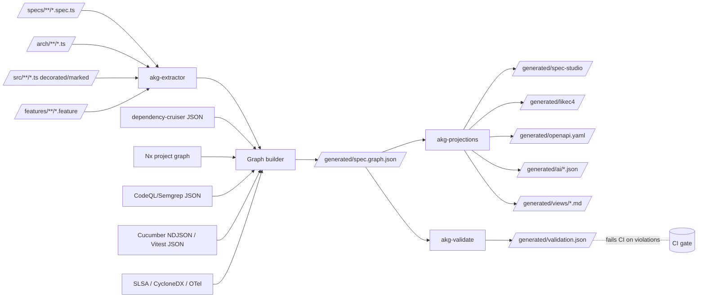
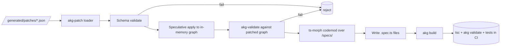

# 02 — System Architecture

This document describes the layered architecture of Libar Omni: what subsystems exist, what each one is allowed to know, how data flows between them, and the *derived-vs-canonical* rule that keeps the whole thing trustworthy.

The most important architectural decision is also the simplest one:

> **The repository is the canonical store. Everything else — graphs, diagrams, dashboards, the Spec Studio, AI context, OpenAPI exports, JSON-LD — is derived and regenerable.**

Every architectural choice below follows from that rule.

---

## 1. The four layers

```
┌──────────────────────────────────────────────────────────────────────────┐
│  Layer 4 — Projections (read-only views)                                 │
│  HTML Spec Studio · LikeC4 diagrams · OpenAPI/AsyncAPI · ADR index ·     │
│  JSON-LD export · AI context slices · traceability matrices · dashboards │
│  ↑ generated from Layer 3                                                │
├──────────────────────────────────────────────────────────────────────────┤
│  Layer 3 — Canonical graph                                               │
│  /generated/spec.graph.json (+ in-memory model)                          │
│  ↑ produced by Layer 2 from Layer 1                                      │
├──────────────────────────────────────────────────────────────────────────┤
│  Layer 2 — Extractors + validators                                       │
│  @akg/extractor (ts-morph) · @akg/validate · readiness profiles ·        │
│  schema validators (Zod/Ajv) · arch tests · lint rules                   │
│  ↑ reads Layer 1                                                         │
├──────────────────────────────────────────────────────────────────────────┤
│  Layer 1 — Authoring + runtime source (the truth)                        │
│  /specs/**/*.spec.ts · /arch/**/*.ts · /src/**/*.ts (Fastify + Effect) · │
│  /tests/**/*.ts · /features/**/*.feature · ADR markdown                  │
└──────────────────────────────────────────────────────────────────────────┘
                              ↑ patches ↑
                       /generated/patches/*.json
                  (the closed loop from Layer 4 back to Layer 1)
```

### Layer 1 — the truth

Everything in Layer 1 is *committed by humans (or by validated patches)*. Hand-edits, code review, `tsc`, ESLint, and Git history all apply. This layer comprises:

- **Typed delivery model** (`/specs/**/*.spec.ts`, `/arch/**/*.ts`).
- **Product source code** (`/src/**/*.ts`) — Fastify routes, Effect Layers, use cases, repositories, adapters.
- **Tests** (`/tests/**/*.ts`, `/features/**/*.feature` + `/features/steps/*.ts`, `/tests/e2e/*.playwright.ts`).
- **ADR markdown** (`/arch/decisions/*.md`) — markdown is fine here; ADRs are referenced *by ID*, not parsed for semantics.
- **Configuration** (`tsconfig*.json`, `akg.config.ts`, lint configs, dependency-cruiser rules).

### Layer 2 — extractors and validators

Layer 2 is *pure functions*. It reads Layer 1 and produces Layer 3 deterministically. There is no state, no IO beyond reading source files and writing the graph + reports. Components:

- **`@akg/extractor`** — `ts-morph`-based reader. Sub-extractors for:
  - typed model (`.spec.ts` files) via `Project.getSourceFiles`.
  - decorators (`getDecorators()` → factory argument parsing).
  - JSDoc tags (`getJsDocs()` → custom tag extraction).
  - marker constants (`markImplementation({...})` AST patterns).
  - Fastify routes (registered via `defineRoute(...)` or `app.post(...)` patterns).
  - Effect Layers (calls to `Layer.effect`, `Layer.succeed`, `Context.Tag`).
  - Awilix registrations (`asClass`, `asValue`, `asFunction`) when present.
  - test discovery (Vitest/Cucumber/Playwright via filename + AST signature).
  - Gherkin (`.feature` files) parsed via the official Cucumber Gherkin parser.
- **Overlay extractors** (optional, opt-in):
  - `dependency-cruiser` JSON output → inferred `dependsOn` edges with provenance `inferred`.
  - Nx project graph (`nx graph --json`) → component/project relations.
  - CodeQL or Semgrep results → dataflow edges (`reachesData`, `callsExternal`).
- **`@akg/validate`** — pure validators consuming the graph. See `06-extraction-and-validation.md` for the tier breakdown.

### Layer 3 — canonical graph

The graph is materialised in two forms:

1. **`/generated/spec.graph.json`** — committed-only-if-CI-deems-stable, otherwise gitignored. Schema-pinned (JSON Schema + versioned).
2. **In-memory model** — a `Graph` object exposing typed queries (`graph.specs()`, `graph.componentsByCapability(id)`, `graph.impactOf(specId)`, `graph.unverifiedExecutable()`).

The graph schema is itself published as a TypeScript type and a JSON Schema. Every consumer (Spec Studio, AI slicer, OpenAPI generator) imports the type.

### Layer 4 — projections

Every view is computed from Layer 3. They are *write-only outputs*: nobody edits them. Concretely:

- HTML Spec Studio (`/generated/spec-studio/`).
- LikeC4 view files (`/generated/likec4/views/*.likec4`).
- OpenAPI / AsyncAPI documents (`/generated/openapi.yaml`).
- JSON-LD (`/generated/spec.graph.jsonld`).
- AI slices (`/generated/ai/*.json`).
- Traceability matrices (`/generated/views/traceability.md`).
- ADR index (`/generated/views/adr-index.md`).
- Status dashboards (`/generated/views/readiness-dashboard.html`).

---

## 2. The patch-back loop

The one "write" path from Layer 4 back to Layer 1 is the **patch-back loop**:

```
Spec Studio (Layer 4)
    ↓ user interaction
patch JSON (RFC 6902-style JSON Patch + custom ops)
    ↓ akg patch validate
schema check (against spec schema)
graph check (does the patched graph still satisfy invariants?)
    ↓ akg patch apply
codemod via ts-morph
    ↓ writes
.spec.ts files (Layer 1)
    ↓ tsc + akg validate + tests
green CI
```

This is the *only* sanctioned write path from a derived layer back to the canonical one. Direct HTML edits, free-form prompt outputs, or AI agents writing `.spec.ts` files without going through `akg patch apply` are out of scope and will not be detected as "real" updates.

`★ Insight ─────────────────────────────────────`
The patch loop is what makes "specs as code + HTML as lens" defensible. Without it, you either (a) have to manually transcribe HTML edits back to TypeScript (which kills the UX promise) or (b) accept that HTML becomes the de-facto truth (which kills the type safety promise). The validated patch is the bridge that preserves both.
`─────────────────────────────────────────────────`

---

## 3. Package boundaries (the monorepo shape)

The system is organised as a **pnpm workspace** with TypeScript **project references**. Each package has a narrowly scoped responsibility and a public API.

```
/packages/
  akg-spec/          # the typed DSL — what consumers import to author specs
  akg-markers/       # source-code marker library (decorators + JSDoc parsers + marker constants)
  akg-graph/         # the graph schema and Graph query API (TS types + runtime)
  akg-extractor/     # ts-morph-based extractor; the only package that calls TypeScript Compiler API
  akg-validate/      # validators (schema + graph + arch tests + readiness profiles)
  akg-projections/   # generators for HTML Spec Studio, LikeC4, OpenAPI, JSON-LD, AI slices, dashboards
  akg-patch/         # patch schema, validation, codemod application
  akg-cli/           # the `akg` binary; thin orchestrator over the other packages
  akg-runtime/       # tiny runtime helpers (`defineRoute`, `defineArchLayer`, `markImplementation`)
  akg-test/          # test-side helpers (`specTest`, `executableExample`, Cucumber Messages ingestor)
  akg-config/        # config loader (akg.config.ts) and presets
```

Dependency direction (always top-down):

```
akg-cli ─→ {akg-extractor, akg-validate, akg-projections, akg-patch}
akg-projections ─→ akg-graph
akg-validate ─→ akg-graph
akg-extractor ─→ akg-graph (+ ts-morph as external)
akg-patch ─→ akg-graph (+ ts-morph)
akg-runtime ─→ akg-spec
akg-markers ─→ akg-spec (no runtime deps)
akg-test ─→ akg-spec (+ vitest / @cucumber/messages as peer)
akg-spec ─→ ∅ (no internal deps)
akg-graph ─→ akg-spec (only the type definitions, no runtime)
```

`akg-spec` is the *root* — pure types, branded IDs, and the constructors (`spec()`, `specPack()`, `example()`, `rule()`, `quality()`, etc.). Importing it has zero runtime cost.

`★ Insight ─────────────────────────────────────`
`akg-runtime` and `akg-markers` are kept separate so product code can import marker helpers without pulling in any DSL types or vice versa. This matters in monorepos that ship code to size-sensitive runtimes (Lambdas, edge functions). Source-code markers compile to small, tree-shakeable artifacts; the spec DSL doesn't ship at all.
`─────────────────────────────────────────────────`

---

## 4. Data flow walkthrough

### 4.1 Build flow (`akg build`)



Step by step:

1. **Source discovery.** `Project.addSourceFilesAtPaths(["specs/**/*.spec.ts","arch/**/*.ts","src/**/*.ts"])` plus Gherkin glob.
2. **Typed model extraction.** Visit each `.spec.ts` file, find calls to `spec(...)`, `specPack(...)`, etc., and reify the arguments. Use TypeScript's static evaluator for `as const`-style literals; fall back to a small expression evaluator for `ref("…")` and similar helpers.
3. **Source-marker extraction.** For each source file, scan for `@arch.node({...})` decorators, `markImplementation({...})` calls, and JSDoc `@akg.*` tags. Each yields candidate graph nodes/edges with provenance `annotation`.
4. **Runtime anchor extraction.** Scan for `defineRoute(...)`, `defineArchLayer(...)`, `Layer.effect(...)`, `Context.Tag(...)`, Awilix `asClass(...)`. Build `api:*` and `layer:*` nodes.
5. **Gherkin parsing.** Use `@cucumber/gherkin` to parse `.feature` files; each `Feature`/`Rule`/`Scenario` plus its tags becomes a graph node + edges.
6. **Overlay ingestion** (optional). Feed dependency-cruiser JSON, Nx graph JSON, and CodeQL/Semgrep findings into the graph as inferred edges with `confidence` levels.
7. **Evidence ingestion** (optional). Latest CI artifacts: Cucumber Messages NDJSON, Vitest JSON reporter output, Playwright JSON, SLSA attestations, CycloneDX SBOMs, OTel summaries. Populate `EvidenceFacet` and `VerificationFacet.lastResult`.
8. **Graph materialisation.** Emit `/generated/spec.graph.json`, schema-checked against the published graph schema.
9. **Validation.** `@akg/validate` runs all tiers; emits `/generated/validation.json`. Non-empty `errors` array exits non-zero.
10. **Projections.** `@akg/projections` generates the Spec Studio, LikeC4 model, OpenAPI/AsyncAPI, JSON-LD, AI slices, traceability matrix, dashboards.

The whole flow is incremental — see §5 below.

### 4.2 Patch flow (`akg patch apply`)



The patched graph is computed *before* any source file is touched. Any validator failure aborts the apply, leaving the repo untouched. This is the inverse of the usual "apply then validate" — it makes patch application transactional.

---

## 5. Incremental builds

A repo with thousands of `.spec.ts` files and tens of thousands of TypeScript modules cannot afford a full re-extract on every CI run.

### 5.1 The cache

`akg build --incremental` keeps `/generated/.akg-cache/` containing:

- `sources.manifest.json` — file → SHA-256 hash + last extracted timestamp.
- `partial-graph/<filehash>.json` — per-file extracted node/edge fragments.
- `tsbuildinfo` integration — TypeScript's incremental compilation buildinfo is read to detect which files actually need re-AST traversal.

On rebuild, the extractor walks the file set, hashes each file, and skips files whose hash matches the manifest. Their partial graph fragments are re-loaded. Only changed files are re-extracted.

The graph builder merges all partial fragments and runs *cross-file* validation passes (ID uniqueness, reference resolution, cycle detection). Cross-file passes are O(n) over the graph, not over source.

### 5.2 Project references

For very large monorepos, the project itself is split into TypeScript project references. Each referenced project produces its own `partial-graph.json`. The top-level `akg.config.ts` declares the merge order and resolves cross-project references.

### 5.3 The cache is regenerable

Like every Layer-4 artifact, the cache is regenerable. CI may choose to skip it (cold builds) for reproducibility. Local dev uses it for speed.

---

## 6. Where Fastify and Effect fit

Fastify and Effect Layers (the recommended runtime anchor — see `05-runtime-anchors.md`) sit *inside Layer 1*, not next to it. They are product source code. The architecture graph treats them specifically because:

- **Fastify routes become `api:*` nodes.** The extractor reads the `defineRoute(...)` declarations (or `app.<method>(…)` calls in a Fastify-plugin convention).
- **Effect Layer declarations become `layer:*` nodes.** A `Layer.effect(Tag, ...)` call yields a `layer:*` node that *provides* a `port:*` (the tag) and *requires* the tags consumed by its `Effect.gen` body.
- **The runtime dependency graph thus becomes a typed sub-graph.** Validators can check that no singleton layer depends on a request-scoped layer, no `component:orders-api` depends on `external:postgres` directly, etc.

The point is that Libar Omni does not *introduce* the runtime composition — it *reads* it. The architecture graph is a derived view over choices you would have made anyway.

`★ Insight ─────────────────────────────────────`
This is what separates the design from "documentation generators". Tools like Structurizr or pure LikeC4 require you to write the model *in addition to* the code. Libar Omni's runtime extractor reads what is already there — Fastify routes, Effect Layers, decorators — and only asks you to author the *intent* (spec files) and *bindings* (decorators). The architecture diagram is then a function of the live code, not a separately maintained drawing.
`─────────────────────────────────────────────────`

---

## 7. The derived-vs-canonical rule (restated as invariants)

Three invariants the system enforces about itself:

### Invariant 1 — *Layer 4 is purely a function of Layer 3.*

Given an identical `spec.graph.json`, projections must be byte-identical (modulo non-deterministic UI assets like timestamps in HTML metadata — these are explicitly disabled). The Spec Studio HTML is reproducible. A CI step `akg projections --check-clean` regenerates and `git diff --quiet` to detect drift.

### Invariant 2 — *Layer 3 is purely a function of Layer 1 (+ pinned overlay inputs).*

Given the same source files, the same dependency-cruiser JSON, the same Cucumber Messages, etc., the graph must be byte-identical. The extractor is deterministic; ordering is stable (specs sorted by ID, edges by `(from, type, to)`).

### Invariant 3 — *Layer 1 is only modified by humans or by `akg patch apply`.*

CI rejects PRs that modify `/generated/` directly (a path-allowlist hook). The HTML Spec Studio never writes to disk in production; it only exports patches.

These three invariants are what allow the system to be trusted: any time the graph "drifts" from the source, you have a reproducible bug in Layer 2 (extractor), not a synchronisation problem.

---

## 8. Configuration surface

`akg.config.ts` at the repo root drives the behaviour:

```ts
import { defineConfig } from "@akg/config";

export default defineConfig({
  // root paths
  paths: {
    specs:    ["specs/**/*.spec.ts"],
    arch:     ["arch/**/*.ts"],
    source:   ["src/**/*.ts"],
    features: ["features/**/*.feature"],
    tests: {
      vitest:     ["tests/**/*.spec.ts"],
      cucumber:   ["features/**/*.feature"],
      playwright: ["tests/e2e/**/*.playwright.ts"],
    },
  },

  // runtime anchor — drives which extractors are enabled
  runtimeAnchor: "fastify+effect",  // | "fastify+awilix" | "effect-only" | "custom"

  // overlay extractors
  overlays: {
    dependencyCruiser: { enabled: true, configFile: ".dependency-cruiser.cjs" },
    nx:                { enabled: false },
    codeql:            { enabled: false },
    semgrep:           { enabled: false },
  },

  // evidence sources
  evidence: {
    cucumber:   { ndjsonPath: "generated/cucumber.ndjson" },
    vitest:     { jsonPath:   "generated/vitest.json" },
    playwright: { jsonPath:   "generated/playwright.json" },
    otel:       { source:     "honeycomb", queries: "evidence/otel-queries.yaml" },
    slsa:       { attestationPath: "generated/slsa/" },
    sbom:       { cyclonedxPath:   "generated/sbom.cdx.json" },
  },

  // validation
  validation: {
    profiles: "default",          // or path to custom profile module
    failOn:   ["error"],          // ["error","warning"] to fail on warnings too
    rules: {
      // toggle individual rules
      "no-orphan-implementation": "error",
      "executable-needs-tests":   "error",
      "verified-needs-evidence":  "error",
      "nfr-needs-target":         "warning",
    },
  },

  // projections
  projections: {
    studio:    { enabled: true,  outDir: "generated/spec-studio" },
    likec4:    { enabled: true,  outDir: "generated/likec4" },
    openapi:   { enabled: true,  outFile: "generated/openapi.yaml" },
    asyncapi:  { enabled: false, outFile: "generated/asyncapi.yaml" },
    jsonld:    { enabled: true,  outFile: "generated/spec.graph.jsonld" },
    aiSlices:  { enabled: true,  outDir:  "generated/ai", presets: ["per-pack","per-capability","change-impact"] },
    docs:      { enabled: true,  outDir:  "generated/views" },
  },

  // patch loop
  patch: {
    allowedTargets:     ["spec.*","pack.*"],     // ID patterns patches may modify
    requireApprovalFor: ["readiness>=designed"], // human gate for risky changes
  },
});
```

The config is itself a TypeScript module — type-checked, refactor-able, and the values flow into every package via a small `loadConfig()` helper.

---

## 9. CI integration

Recommended CI pipeline:

```yaml
# .github/workflows/akg.yml (illustrative)
jobs:
  akg:
    steps:
      - checkout
      - pnpm install
      - pnpm tsc --build              # type-check (incl. /specs)
      - pnpm dependency-cruiser ...    # produces dep-cruiser JSON for overlays
      - pnpm vitest --reporter=json    # produces tests/results JSON
      - pnpm cucumber --format message:generated/cucumber.ndjson
      - pnpm playwright test --reporter=json
      - pnpm akg build                 # extracts graph + projections
      - pnpm akg validate              # fails on violations
      - pnpm akg projections --check-clean  # invariant 1 check
      - upload-artifact: generated/    # for Spec Studio publish
```

The Spec Studio HTML is then uploaded to S3 (or any static host) with the PR/branch as a path prefix; reviewers and stakeholders get a link.

### 9.1 The `akg validate` gate

`akg validate` has structured exit codes:

| Exit | Meaning | Typical CI policy |
|---|---|---|
| 0 | All validators passed. | Continue. |
| 1 | Error-tier violations. | Fail. |
| 2 | Warning-tier violations (when `failOn: ["warning"]`). | Fail or annotate. |
| 3 | Internal validator error (bug). | Fail; file an issue. |

Validators are categorised so teams can tune severity per readiness expectation (see `06-extraction-and-validation.md`).

---

## 10. Local developer experience

The expected dev loop:

```
$ akg watch
[akg] extracting /specs … (cached: 412, changed: 3)
[akg] validating … 2 warnings, 0 errors
[akg] projections regenerated in 1.2s
[akg] Spec Studio at http://localhost:4321
```

`akg watch` is a long-running process backed by:

- `ts-morph` source-file watchers (debounced; only changed files re-extracted).
- A WebSocket server feeding the Spec Studio with `graph-updated` events for live reload.
- Optional integration with the IDE: a Language Service plugin (longer-term) that surfaces `akg validate` warnings inline.

The Spec Studio served by `akg watch` is the **same generated HTML** as in CI — no separate "dev mode" surface to drift away from production.

---

## 11. Risk surface and mitigations (architectural)

| Risk | Mitigation |
|---|---|
| Graph extractor performance on large repos | Incremental extraction + per-file caching; project references for sharding. |
| `ts-morph` AST evaluation edge cases | Restrict spec DSL to deterministic, side-effect-free `as const` literals + small helpers (`ref`, `rule`, `quality`); reject non-literal arguments at extraction time. |
| Patch-back races with concurrent edits | Patches carry a `baseGraphHash`; apply rejects if hash differs (`409 Conflict`-style). |
| Validator false negatives (silent passes) | Every validator has a corresponding test in `akg-validate` exercising a hand-crafted bad graph. |
| Generated artifacts checked into VCS by mistake | Path allowlist + pre-commit hook + CI `--check-clean`. |
| Drift between Spec Studio runtime JS and graph schema version | Schema version is embedded in `spec.graph.json` and verified by Studio JS at load. |
| Stale `SpecId` union | `akg build` writes `/generated/spec-ids.d.ts` and `tsc` runs *after* the union is regenerated. A missing union file fails the build loudly. |

---

## 12. What this architecture does *not* require

To keep adoption realistic, none of the following are mandatory:

- A graph database. The repo file + in-memory graph + JSON-LD export are enough until you measure traversal pain.
- A bespoke TypeScript transformer. Tier the gate (TS → schema → graph) instead of failing `tsc` on architectural rules.
- A custom IDE plugin. Spec Studio + CLI cover authoring; an IDE plugin is purely ergonomic.
- A migration of all source code to Effect. Awilix or a plain class-DI is a valid `runtimeAnchor`.
- A change to existing test stacks. Vitest, Cucumber, and Playwright are first-class; Jest, Mocha, Cypress need only adapter modules.
- A migration off Jira/Linear. Integrate via MCP or webhooks if desired; do not import process state into the graph.

These reductions are deliberate. Each one was considered in the input discussion and rejected as v1 scope.
