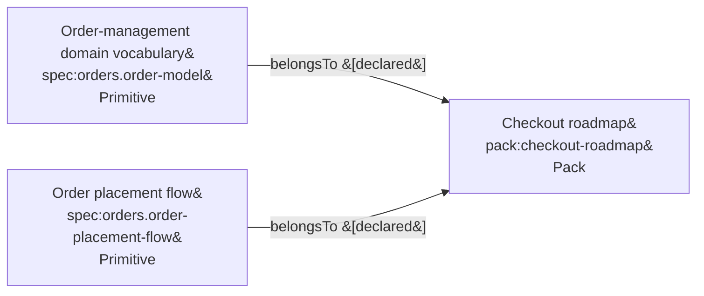

# Pack membership: pack:checkout-roadmap

```mermaid
flowchart LR
  n_007000610063006b003a0063006800650063006b006f00750074002d0072006f00610064006d00610070["Checkout roadmap&#10;pack:checkout-roadmap&#10;Pack"]
  n_0073007000650063003a006f00720064006500720073002e006f0072006400650072002d006d006f00640065006c["Order-management domain vocabulary&#10;spec:orders.order-model&#10;Primitive"]
  n_0073007000650063003a006f00720064006500720073002e006f0072006400650072002d0070006c006100630065006d0065006e0074002d0066006c006f0077["Order placement flow&#10;spec:orders.order-placement-flow&#10;Primitive"]
  n_0073007000650063003a006f00720064006500720073002e006f0072006400650072002d006d006f00640065006c -->|"belongsTo &#91;declared&#93;"| n_007000610063006b003a0063006800650063006b006f00750074002d0072006f00610064006d00610070
  n_0073007000650063003a006f00720064006500720073002e006f0072006400650072002d0070006c006100630065006d0065006e0074002d0066006c006f0077 -->|"belongsTo &#91;declared&#93;"| n_007000610063006b003a0063006800650063006b006f00750074002d0072006f00610064006d00610070
```

_Generated from the one graph by `sdp mermaid` — read-only; regenerate to update._
