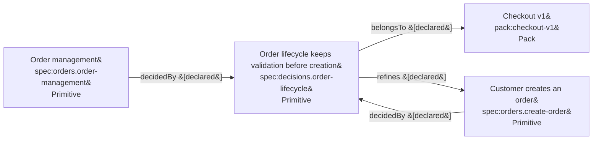

# Spec one-hop: spec:decisions.order-lifecycle

```mermaid
flowchart LR
  n_007000610063006b003a0063006800650063006b006f00750074002d00760031["Checkout v1&#10;pack:checkout-v1&#10;Pack"]
  n_0073007000650063003a006400650063006900730069006f006e0073002e006f0072006400650072002d006c006900660065006300790063006c0065["Order lifecycle keeps validation before creation&#10;spec:decisions.order-lifecycle&#10;Primitive"]
  n_0073007000650063003a006f00720064006500720073002e006300720065006100740065002d006f0072006400650072["Customer creates an order&#10;spec:orders.create-order&#10;Primitive"]
  n_0073007000650063003a006f00720064006500720073002e006f0072006400650072002d006d0061006e006100670065006d0065006e0074["Order management&#10;spec:orders.order-management&#10;Primitive"]
  n_0073007000650063003a006400650063006900730069006f006e0073002e006f0072006400650072002d006c006900660065006300790063006c0065 -->|"belongsTo &#91;declared&#93;"| n_007000610063006b003a0063006800650063006b006f00750074002d00760031
  n_0073007000650063003a006400650063006900730069006f006e0073002e006f0072006400650072002d006c006900660065006300790063006c0065 -->|"refines &#91;declared&#93;"| n_0073007000650063003a006f00720064006500720073002e006300720065006100740065002d006f0072006400650072
  n_0073007000650063003a006f00720064006500720073002e006300720065006100740065002d006f0072006400650072 -->|"decidedBy &#91;declared&#93;"| n_0073007000650063003a006400650063006900730069006f006e0073002e006f0072006400650072002d006c006900660065006300790063006c0065
  n_0073007000650063003a006f00720064006500720073002e006f0072006400650072002d006d0061006e006100670065006d0065006e0074 -->|"decidedBy &#91;declared&#93;"| n_0073007000650063003a006400650063006900730069006f006e0073002e006f0072006400650072002d006c006900660065006300790063006c0065
```

_Generated from the one graph by `sdp mermaid` — read-only; regenerate to update._
