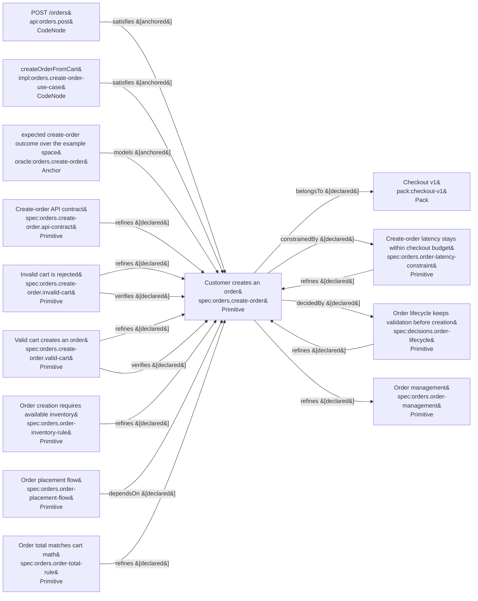

# Spec one-hop: spec:orders.create-order

```mermaid
flowchart LR
  n_006100700069003a006f00720064006500720073002e0070006f00730074["POST /orders&#10;api:orders.post&#10;CodeNode"]
  n_0069006d0070006c003a006f00720064006500720073002e006300720065006100740065002d006f0072006400650072002d007500730065002d0063006100730065["createOrderFromCart&#10;impl:orders.create-order-use-case&#10;CodeNode"]
  n_006f007200610063006c0065003a006f00720064006500720073002e006300720065006100740065002d006f0072006400650072["expected create-order outcome over the example space&#10;oracle:orders.create-order&#10;Anchor"]
  n_007000610063006b003a0063006800650063006b006f00750074002d00760031["Checkout v1&#10;pack:checkout-v1&#10;Pack"]
  n_0073007000650063003a006400650063006900730069006f006e0073002e006f0072006400650072002d006c006900660065006300790063006c0065["Order lifecycle keeps validation before creation&#10;spec:decisions.order-lifecycle&#10;Primitive"]
  n_0073007000650063003a006f00720064006500720073002e006300720065006100740065002d006f0072006400650072["Customer creates an order&#10;spec:orders.create-order&#10;Primitive"]
  n_0073007000650063003a006f00720064006500720073002e006300720065006100740065002d006f0072006400650072002e006100700069002d0063006f006e00740072006100630074["Create-order API contract&#10;spec:orders.create-order.api-contract&#10;Primitive"]
  n_0073007000650063003a006f00720064006500720073002e006300720065006100740065002d006f0072006400650072002e0069006e00760061006c00690064002d0063006100720074["Invalid cart is rejected&#10;spec:orders.create-order.invalid-cart&#10;Primitive"]
  n_0073007000650063003a006f00720064006500720073002e006300720065006100740065002d006f0072006400650072002e00760061006c00690064002d0063006100720074["Valid cart creates an order&#10;spec:orders.create-order.valid-cart&#10;Primitive"]
  n_0073007000650063003a006f00720064006500720073002e006f0072006400650072002d0069006e00760065006e0074006f00720079002d00720075006c0065["Order creation requires available inventory&#10;spec:orders.order-inventory-rule&#10;Primitive"]
  n_0073007000650063003a006f00720064006500720073002e006f0072006400650072002d006c006100740065006e00630079002d0063006f006e00730074007200610069006e0074["Create-order latency stays within checkout budget&#10;spec:orders.order-latency-constraint&#10;Primitive"]
  n_0073007000650063003a006f00720064006500720073002e006f0072006400650072002d006d0061006e006100670065006d0065006e0074["Order management&#10;spec:orders.order-management&#10;Primitive"]
  n_0073007000650063003a006f00720064006500720073002e006f0072006400650072002d0070006c006100630065006d0065006e0074002d0066006c006f0077["Order placement flow&#10;spec:orders.order-placement-flow&#10;Primitive"]
  n_0073007000650063003a006f00720064006500720073002e006f0072006400650072002d0074006f00740061006c002d00720075006c0065["Order total matches cart math&#10;spec:orders.order-total-rule&#10;Primitive"]
  n_006100700069003a006f00720064006500720073002e0070006f00730074 -->|"satisfies &#91;anchored&#93;"| n_0073007000650063003a006f00720064006500720073002e006300720065006100740065002d006f0072006400650072
  n_0069006d0070006c003a006f00720064006500720073002e006300720065006100740065002d006f0072006400650072002d007500730065002d0063006100730065 -->|"satisfies &#91;anchored&#93;"| n_0073007000650063003a006f00720064006500720073002e006300720065006100740065002d006f0072006400650072
  n_006f007200610063006c0065003a006f00720064006500720073002e006300720065006100740065002d006f0072006400650072 -->|"models &#91;anchored&#93;"| n_0073007000650063003a006f00720064006500720073002e006300720065006100740065002d006f0072006400650072
  n_0073007000650063003a006400650063006900730069006f006e0073002e006f0072006400650072002d006c006900660065006300790063006c0065 -->|"refines &#91;declared&#93;"| n_0073007000650063003a006f00720064006500720073002e006300720065006100740065002d006f0072006400650072
  n_0073007000650063003a006f00720064006500720073002e006300720065006100740065002d006f0072006400650072 -->|"belongsTo &#91;declared&#93;"| n_007000610063006b003a0063006800650063006b006f00750074002d00760031
  n_0073007000650063003a006f00720064006500720073002e006300720065006100740065002d006f0072006400650072 -->|"constrainedBy &#91;declared&#93;"| n_0073007000650063003a006f00720064006500720073002e006f0072006400650072002d006c006100740065006e00630079002d0063006f006e00730074007200610069006e0074
  n_0073007000650063003a006f00720064006500720073002e006300720065006100740065002d006f0072006400650072 -->|"decidedBy &#91;declared&#93;"| n_0073007000650063003a006400650063006900730069006f006e0073002e006f0072006400650072002d006c006900660065006300790063006c0065
  n_0073007000650063003a006f00720064006500720073002e006300720065006100740065002d006f0072006400650072 -->|"refines &#91;declared&#93;"| n_0073007000650063003a006f00720064006500720073002e006f0072006400650072002d006d0061006e006100670065006d0065006e0074
  n_0073007000650063003a006f00720064006500720073002e006300720065006100740065002d006f0072006400650072002e006100700069002d0063006f006e00740072006100630074 -->|"refines &#91;declared&#93;"| n_0073007000650063003a006f00720064006500720073002e006300720065006100740065002d006f0072006400650072
  n_0073007000650063003a006f00720064006500720073002e006300720065006100740065002d006f0072006400650072002e0069006e00760061006c00690064002d0063006100720074 -->|"refines &#91;declared&#93;"| n_0073007000650063003a006f00720064006500720073002e006300720065006100740065002d006f0072006400650072
  n_0073007000650063003a006f00720064006500720073002e006300720065006100740065002d006f0072006400650072002e0069006e00760061006c00690064002d0063006100720074 -->|"verifies &#91;declared&#93;"| n_0073007000650063003a006f00720064006500720073002e006300720065006100740065002d006f0072006400650072
  n_0073007000650063003a006f00720064006500720073002e006300720065006100740065002d006f0072006400650072002e00760061006c00690064002d0063006100720074 -->|"refines &#91;declared&#93;"| n_0073007000650063003a006f00720064006500720073002e006300720065006100740065002d006f0072006400650072
  n_0073007000650063003a006f00720064006500720073002e006300720065006100740065002d006f0072006400650072002e00760061006c00690064002d0063006100720074 -->|"verifies &#91;declared&#93;"| n_0073007000650063003a006f00720064006500720073002e006300720065006100740065002d006f0072006400650072
  n_0073007000650063003a006f00720064006500720073002e006f0072006400650072002d0069006e00760065006e0074006f00720079002d00720075006c0065 -->|"refines &#91;declared&#93;"| n_0073007000650063003a006f00720064006500720073002e006300720065006100740065002d006f0072006400650072
  n_0073007000650063003a006f00720064006500720073002e006f0072006400650072002d006c006100740065006e00630079002d0063006f006e00730074007200610069006e0074 -->|"refines &#91;declared&#93;"| n_0073007000650063003a006f00720064006500720073002e006300720065006100740065002d006f0072006400650072
  n_0073007000650063003a006f00720064006500720073002e006f0072006400650072002d0070006c006100630065006d0065006e0074002d0066006c006f0077 -->|"dependsOn &#91;declared&#93;"| n_0073007000650063003a006f00720064006500720073002e006300720065006100740065002d006f0072006400650072
  n_0073007000650063003a006f00720064006500720073002e006f0072006400650072002d0074006f00740061006c002d00720075006c0065 -->|"refines &#91;declared&#93;"| n_0073007000650063003a006f00720064006500720073002e006300720065006100740065002d006f0072006400650072
```

_Generated from the one graph by `sdp mermaid` — read-only; regenerate to update._
