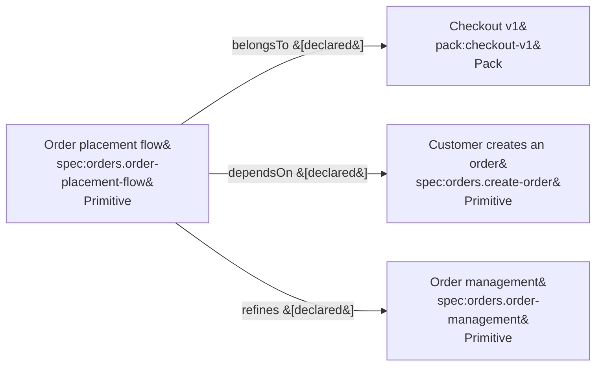

# Spec one-hop: spec:orders.order-placement-flow

```mermaid
flowchart LR
  n_007000610063006b003a0063006800650063006b006f00750074002d00760031["Checkout v1&#10;pack:checkout-v1&#10;Pack"]
  n_0073007000650063003a006f00720064006500720073002e006300720065006100740065002d006f0072006400650072["Customer creates an order&#10;spec:orders.create-order&#10;Primitive"]
  n_0073007000650063003a006f00720064006500720073002e006f0072006400650072002d006d0061006e006100670065006d0065006e0074["Order management&#10;spec:orders.order-management&#10;Primitive"]
  n_0073007000650063003a006f00720064006500720073002e006f0072006400650072002d0070006c006100630065006d0065006e0074002d0066006c006f0077["Order placement flow&#10;spec:orders.order-placement-flow&#10;Primitive"]
  n_0073007000650063003a006f00720064006500720073002e006f0072006400650072002d0070006c006100630065006d0065006e0074002d0066006c006f0077 -->|"belongsTo &#91;declared&#93;"| n_007000610063006b003a0063006800650063006b006f00750074002d00760031
  n_0073007000650063003a006f00720064006500720073002e006f0072006400650072002d0070006c006100630065006d0065006e0074002d0066006c006f0077 -->|"dependsOn &#91;declared&#93;"| n_0073007000650063003a006f00720064006500720073002e006300720065006100740065002d006f0072006400650072
  n_0073007000650063003a006f00720064006500720073002e006f0072006400650072002d0070006c006100630065006d0065006e0074002d0066006c006f0077 -->|"refines &#91;declared&#93;"| n_0073007000650063003a006f00720064006500720073002e006f0072006400650072002d006d0061006e006100670065006d0065006e0074
```

_Generated from the one graph by `sdp mermaid` — read-only; regenerate to update._
