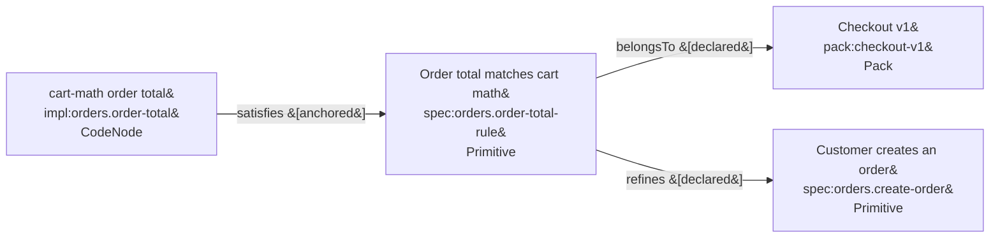

# Spec one-hop: spec:orders.order-total-rule

```mermaid
flowchart LR
  n_0069006d0070006c003a006f00720064006500720073002e006f0072006400650072002d0074006f00740061006c["cart-math order total&#10;impl:orders.order-total&#10;CodeNode"]
  n_007000610063006b003a0063006800650063006b006f00750074002d00760031["Checkout v1&#10;pack:checkout-v1&#10;Pack"]
  n_0073007000650063003a006f00720064006500720073002e006300720065006100740065002d006f0072006400650072["Customer creates an order&#10;spec:orders.create-order&#10;Primitive"]
  n_0073007000650063003a006f00720064006500720073002e006f0072006400650072002d0074006f00740061006c002d00720075006c0065["Order total matches cart math&#10;spec:orders.order-total-rule&#10;Primitive"]
  n_0069006d0070006c003a006f00720064006500720073002e006f0072006400650072002d0074006f00740061006c -->|"satisfies &#91;anchored&#93;"| n_0073007000650063003a006f00720064006500720073002e006f0072006400650072002d0074006f00740061006c002d00720075006c0065
  n_0073007000650063003a006f00720064006500720073002e006f0072006400650072002d0074006f00740061006c002d00720075006c0065 -->|"belongsTo &#91;declared&#93;"| n_007000610063006b003a0063006800650063006b006f00750074002d00760031
  n_0073007000650063003a006f00720064006500720073002e006f0072006400650072002d0074006f00740061006c002d00720075006c0065 -->|"refines &#91;declared&#93;"| n_0073007000650063003a006f00720064006500720073002e006300720065006100740065002d006f0072006400650072
```

_Generated from the one graph by `sdp mermaid` — read-only; regenerate to update._
